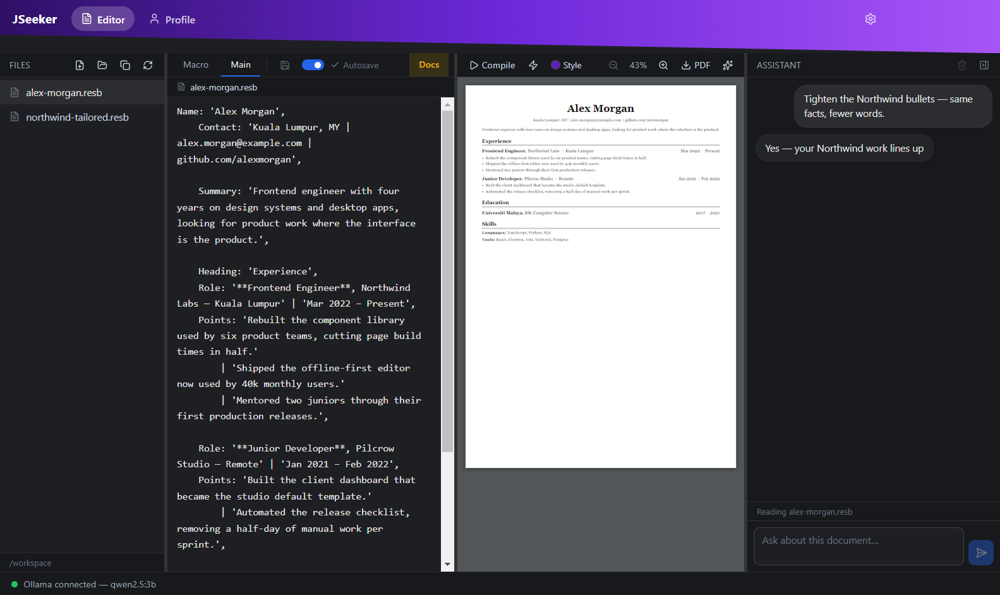
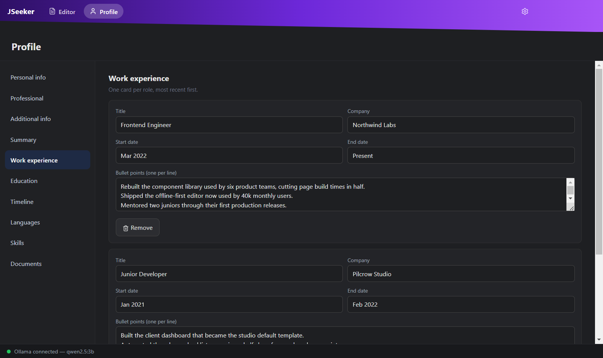

# JSeeker

A desktop app for writing resumes and cover letters. Keep one profile in one place,
lay the document itself out in a small purpose-built language that exports to PDF,
and have a local or hosted LLM — sitting right beside the editor — write, tailor and
reword it for you.

Everything runs on your machine. With a local model, nothing leaves it at all.

**Electron · React 19 · TypeScript · Vite · Tailwind v4 · Ollama / Claude API · Chrome MV3**



---

## What it does

### A resume you write like code, with an assistant that writes it too

`.resb` is a small language for document layout: declare the components once, supply
the content once, get a typeset page. Live preview, font and accent switching, export
to PDF.

The assistant is docked in the same row rather than on a screen of its own, because a
resume gets written by going back and forth — ask for a draft, watch it compile, fix
the line that reads badly. It is handed the open document as context, so "tighten the
second bullet" means the one on screen, and what it writes lands in the workspace two
panes to the left rather than in the chat.

### One profile, filled in for you

Drop in a resume PDF on first run. The text is extracted, turned into structured
sections — experience, education, skills, languages — and folded into the profile by
*meaning*, so importing a second document enriches what's there instead of
duplicating it. Everything stays editable by hand, and it's what every document the
assistant writes is drawn from.



### On the posting, not beside it

A Chrome extension puts the same assistant on any job page with `Alt+J`. It reads the
posting in front of you and can draft a cover letter or a tailored resume from it.
Every posting you work on is filed away, so returning to a page continues its
conversation rather than starting a second one — and the assistant can search back
through them when something you already worked out would save writing it again.

---

## Key concepts

What's actually going on behind the two screens above.

**Desktop architecture** — Electron main/renderer split with `contextIsolation` on and
no Node in the renderer; every privileged operation (disk, dialogs, network, PDF) crosses
a typed `contextBridge` API over IPC. React state is deliberately flat: one store object,
persisted as JSON, with views kept mounted and toggled by CSS so drafts survive
navigation.

**A small language, end to end** — the resume builder is a real pipeline:
`tokenizer → parser → AST → renderer → compiled HTML`. Unknown arguments are compile
errors rather than silent no-ops, and the same compiled document is what gets printed
to PDF.

**LLM integration** — one provider interface with two implementations (local Ollama,
Anthropic API), token-by-token streaming pushed to the UI over IPC, prompt construction
from structured profile data, and a first-run model pull with live progress.

**Tools, and a skill for the language** — the assistant reads the profile, reads a page,
searches past applications and writes documents through a typed tool layer. `.resb` is
this project's own language, so no model has ever seen it: the syntax is handed over as
a *skill* it loads on demand, and everything it writes is parsed before it is allowed to
reach the workspace.

**Semantic merging** — importing a second document compares entries by embedding
similarity, not string equality, so "Frontend Engineer @ Northwind" and "Frontend
Engineer, Northwind Labs" are recognised as the same role. Falls back to lexical overlap
when no embedding model is available.

**Browser extension (MV3)** — a content script rendering into a closed shadow root so the
host page's CSS and ours can't collide, a service worker relaying server-sent events from
a local HTTP server (a content script can't reach `127.0.0.1` itself), and `activeTab`
rather than `<all_urls>` — the extension holds no standing permission to read your
browsing.

**Local API surface** — the desktop app runs a small authenticated HTTP server for the
extension to talk to: bearer token, SSE streaming, and session records keyed by posting
URL so returning to a page continues its history rather than starting a second one.

**Interface** — Tailwind v4 with semantic design tokens instead of raw hex, CSS-driven
animation, and `prefers-reduced-motion` respected everywhere.

**Privacy by construction** — the extension only ever *reads* a page; it never types,
clicks, or submits. Your profile never enters the browser — page text goes to the app,
only the reply comes back. Nothing extracted from a conversation is written to your
profile until you accept it.

---

## Getting started

```bash
npm install
npm start          # build main + renderer, then launch Electron
```

Optional: [Ollama](https://ollama.com) for local models — otherwise add a Claude API key
under **Settings → Assistant**. Node 20+.

For iterative work, in separate terminals:

```bash
npm run dev            # tsc --watch for main/preload
npm run dev:renderer   # vite build --watch
npm run dev:electron   # launch Electron against the built output
```

| Script | Does |
| --- | --- |
| `npm run build` | Builds the main process and the renderer |
| `npm run typecheck:renderer` | Typechecks the renderer without emitting |
| `npx tsc --noEmit -p src/resume_builder/tsconfig.json` | Typechecks the resume language |
| `npx electron scripts/screenshots/capture.js` | Regenerates the screenshots above from stub data |

### The browser extension

`chrome://extensions` → Developer mode → **Load unpacked** → pick `extension/`, then
paste the token from **Settings → Extension** into its options page. `Alt+J` on any page
opens the panel.

---

## Project layout

```
src/
  main/            Electron main process — windows, JSON store, files,
                   local server for the extension, posting history
  preload/         the contextBridge API exposed as window.api
  renderer/        React UI — Editor (with its assistant dock), Profile, Settings
  agents/          LLM providers (Ollama, Claude), prompts, tools, skills,
                   PDF extraction
  resume_builder/  the .resb language: tokenizer, parser, renderer, compiler
extension/         Chrome MV3 in-page assistant
scripts/           screenshot capture harness
```

## A taste of `.resb`

`macro:` declares the components and how they're styled. `main:` supplies the content
for each one, `|` splitting a block across its columns.

```
macro:(
    Name: Cell(fw : 700, fs : 30, ta : 'Center'),
    Role: Block(spread : 'Between', gap : 16,
        Cell(fs : 13, grow : 1),
        Cell(fs : 13, nowrap : 1)
    )
)
main:(
    Name: 'Your Name',
    Role: '**Frontend Engineer**, Northwind Labs' | 'Mar 2022 – Present'
)
```

The full argument reference lives in the editor's **Docs** tab, beside the source it
describes — and is generated from the same allowlist the compiler and the assistant's
skill both read, so the three can't drift apart.

## Data

Your profile is a plain `store.json` in Electron's `userData` directory; posting history
is `sessions.json` next to it, and your documents are `.resb` files in a workspace folder
beside both. All of it is yours, in the clear, on your disk. `api.key`, `models/`, and
`dist/` are gitignored.
